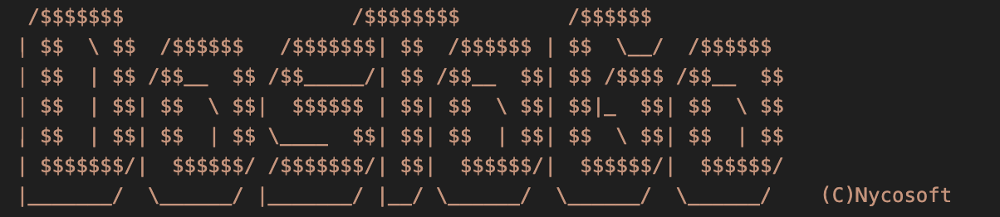

# Nycosoft DosToGo 0.1

DosToGo is a tiny and configurable DOS program launcher developed with QBasic that works with MsDos 6.22 or higher. It's a small fun project and it is published on my personal blog www.gamerdad.cloud. 

# How to install
Run SETUP.EXE and insert the install directory you prefer (C:\DOSTOGO would be the default one)

# How to run it
Type 'go' on the dos shell to choose your destiny!

# Features

To run the DosToGo features you'll have to press the key on your keyboard corresponding to the one present between the parenthesis

## (E)xecute
It executes the selected action for the program in the selected line. Two possible actions: Run, which would run the program, and Browse, which would move the current shell directory into the one containing the selected program

## (R)emove
It removes the program line from the list. A confirmation would be requested from the user. 

## (A)dd 
It adds a new program to the list. It can be chosen to use your current shell directory (the one where you typed 'go') or a completely different one. The user would also be requested to insert the file name to be executed and the program's name. 

## (Q)uit
It simply quits DosToGo and kindly says "Thanks for using DosToGo".

# About the author
My name is Francesco Nicolosi.

I am an IT Service Manager at Gucci, I have always worked in the IT industry as a Software Engineer and IT Manager.

I’ve been passionate about coding and computer science since I was a little kid.

I’m also a multi-dad.

In my spare time, I like playing music keyboards and experimenting with MIDI protocols and sound engineering.

I’m also a big fan of gaming and retro-gaming, both console and pc.

My personal blog https://www.gamerdad.cloud

My linkedin https://www.linkedin.com/in/francesco-nicolosi-43930161/